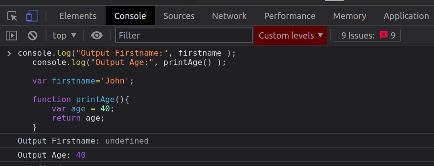
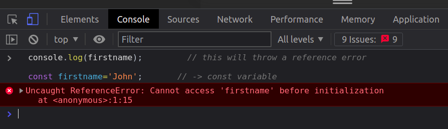
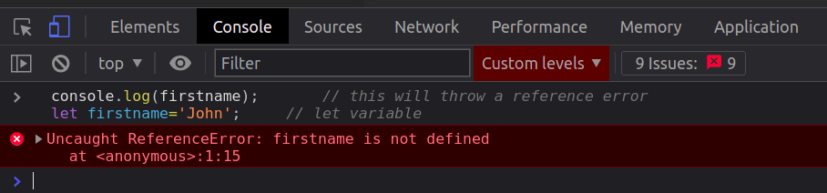
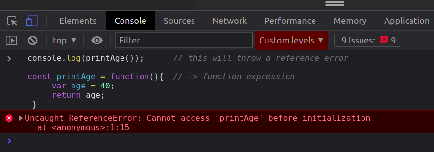
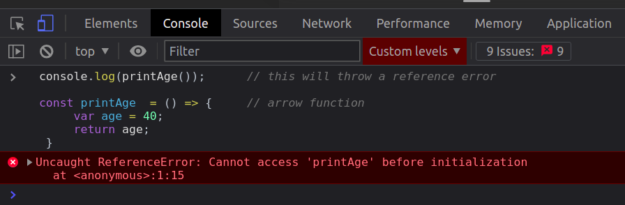

<strong>tl;dr:</strong> During Creation Phase memory is allocated to variables and functions, because of this during Execution Phase variables and functions are available even before they are initialized in the code.

<strong><i>Hoisting is not a feature, it is actually a side effect of javascript’s default behaviour.</i></strong>

To understand hoisting and why it occurs we need to understand what the JS engine does when it is given a piece of code to execute.
The JS engine takes 2 phases to run a given piece of code. These two phases are:
Creation phase
Execution phase

<strong><i>Hoisting is a result of what happens in the Creation Phase.</i></strong>

###Creation Phase

Creation Phase is the phase in which the JS engine goes through the code to allocate space in the memory for all the variables and functions, so that they are available during the Execution Phase when they are referenced in the code.

<strong><i>This memory allocation to variables and functions before code execution is the reason for hoisting.</strong></i>

Variables are given the space in memory for their declarations only but for functions the entire definition is stored in the memory in the creation phase. This is why variables are said to be <strong><i>partially hoisted</i></strong> and functions are said to be <strong><i>completely hoisted</i></strong>.

<strong><i>Example:</i></strong>

```js
  console.log(“Output Firstname:”, firstname );
  console.log(“Output Age:”,  printAge() );

  var firstname='John';

  function printAge(){
      var age = 40;
      return age;
  }
```

When we give this piece of code to the JS engine, it will first run through the code and allocate memory for variable firstname and function printAge, even before executing the first line : console.log(firstname), as we can see in the video below, if we add a breakpoint at the first line we can see that variable “firstname” and function “printAge” are available in the memory

<!--  -->
<div >
<video style="width: 60vw" controls="false" allowfullscreen="false" autoplay>
<source src="hoisting.webm" type="video/webm">
</video>
</div>

Since that variable is already in memory, console.log will not throw any error instead display the value of that variable at point of time which is “undefined”. Same will happen for the function printAge, since functions are completely hoisted the function will be run as usual.

<strong><i>Memory allocation for variables vs functions</i></strong>

If we run the above code the output is


As we observe in the above image function printAge ran correctly but for variable firstname we got undefined, why ?
It is so because when memory is allocated for a variable it’s value is not stored in memory until the line of code which contains the variable initialization is executed, but when memory is allocated for a function the entire function definition is stored in memory.
So prior to the execution phase the variable firstname and function printAge are stored in memory as follows:

firstname : undefined
printAge : function(){ var age = 40; return age; }

Now that we are familiar with the Creation Phase, let's discuss what is hoisting.

###Hoisting

Hoisting is the default behaviour of variables and functions being available even before their initialization.
As we saw in the examples above variable firstname and function printage both were available even before the execution had reached their definitions.

<strong><i>Limitations of hoisting:</i></strong>

Hoisting is limited to variables defined with the keyword var and functions defined with the keyword function.
Hoisting does not apply to “const”, “let” and anonymous functions or arrow functions; these features were introduced in javascript in ES6 or ES2015.

<strong><i>Pros and Cons:</i></strong>

The only advantage of hoisting is that functions are available for execution even before their definition.
The disadvantage of hoisting is that it leads to unpredictable code, which could be a very serious problem for any application.

<strong><i>Best Practices:</i></strong>

How do we avoid hoisting so that our code is not unpredictable in any case?
The answer is, by taking advantage of the limitations of hoisting.

<strong><i>Define variables by using:</i></strong>

1. <strong><i>“const”</i></strong> when you know the value of the variable will remain the same and not change throughout the course your application,

Example:

```js
console.log(firstname) // this will throw a reference error

const firstname = "John" // -> const variable
```

<strong><i>Output:</i></strong>


2. <strong><i>“let”</i></strong> when you need to change the value of the variable

<strong><i>Example:</i></strong>

```js
console.log(firstname) // this will throw a reference error
let firstname = "John" // let variable
```

<strong><i>Output:</i></strong>



<strong><i>Define functions by using:</strong></i>

1.  <strong><i>Anonymous functions.</strong></i>

<strong><i>Example:</i></strong>

```js
console.log(printAge()) // this will throw a reference error

const printAge = function () {
  // -> function expression
  var age = 40
  return age
}
```

<strong><i>Output:</i></strong>



2. <strong><i>Arrow functions.</strong></i>

<strong><i>Example:</i></strong>

```js
console.log(printAge()) // this will throw a reference error

const printAge = () => {
  // arrow function
  var age = 40
  return age
}
```

<strong><i>Output:</i></strong>


This happens because variables defined with let and const and functions that are anonymous or arrow function are not hoisted by JS engine hence this makes the code more predictable and easy to debug.

Stay tuned for more soon...
